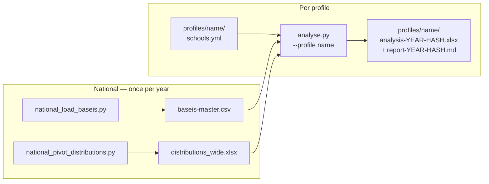

# dear_niece

Predicting the admission mark threshold for Greek university departments (Biology focus) using historical student grade distributions.


## Data

### Student mark distributions

Per-class grade distributions (percentage of students in each score bin), for years 2022–2025.

- Source: `data/distributions.xlsx`, sheet `data-StudentsDistribution`
- 4 subjects: Biology (bio), Physics (phys), Chemistry (chem), Greek Language (lang)
- 12 score bins per subject per year: 0–4.9, 5–9.9, 10–10.9, 11–11.9, …, 19–20.0
- Data origin:
  - [2023 distributions](https://foititikanea.gr/statistika/2022/pinakes/8.php)
  - [2024 distributions](https://www.aeitei.gr/statistika-gel.php?year=2024)
  - [2025 distributions](https://www.aeitei.gr/statistika-gel.php?year=2025)

### University admission thresholds (βάσεις)

Minimum admission scores (on a 0–20,000 scale) per school and year.

- Source: `data/baseis-raw/gel-{YEAR}.xlsx` (raw ministry downloads), combined into `data/_pipeline_cache/baseis-master.csv` by `national_load_baseis.py`
- Profile-specific subsets declared in `profiles/{name}/schools.yml`
- Data origin:
  - [2023 baseis](https://aeitei.gr/index.php?year=2023&pedio=3&likio_type=gh&order=2)
  - [2024 baseis](https://aeitei.gr/index.php?sist=&sys=&vasi=basi&year=2024&pedio=3&aeitei=&city=&likio_type=gh&cat=1&order=2)


## Pipeline



| Script | Runs | Output |
|---|---|---|
| `national_load_baseis.py` | Once per year | `data/_pipeline_cache/baseis-master.csv` |
| `national_pivot_distributions.py` | Once per year | `data/_pipeline_cache/distributions_wide.xlsx` |
| `national_plot_distributions.py` | Optional | `output/distributions_plot.png` |
| `analyse.py --profile name` | Per profile per year | `profiles/name/analysis-{year}-{hash}.xlsx` + `report-{year}-{hash}.md` |
| `build_feature_set.py` | Optional | `output/feature_set.xlsx` (per-(field-3 school, period) feature table) |

See [quickstart.md](quickstart.md) for the full workflow with download URLs.


## Methodology

For each year, a **weighted high-end metric** reduces the four per-subject score
distributions into a single scalar that captures the strength of the high-scoring tail
(the bins that drive admission thresholds most). The year-over-year shift in that metric
is then regressed — per school, by ordinary least squares — against the observed βάσεις
shifts from prior years. Applying that fit to the most recent distribution shift
(distributions are published a year ahead of βάσεις) yields the predicted threshold for
the upcoming year.

The metric weights are **configuration, not code**: they live in `metric_weights.yml`
(repo-root default) and can be overridden per-profile in `schools.yml`. `metrics.py`
materializes the sparse weights into a dense vector, computes the metric, and hashes the
weight set; that hash suffixes the output files and keys a content-addressable
`weights/` store, so runs with different weights coexist. A pytest suite (synthetic data
+ a golden report) guards the pipeline. See [`docs`](docs/source/methodology.md) and
[`architecture.md`](architecture.md) for the full method.

### Future work

- Promote the scripts into a `dn` CLI package — see
  [`design/future_work/refactor_package.md`](design/future_work/refactor_package.md).
- Generalise beyond the 3rd (natural-sciences) field to all four exam fields.

Automatic weight optimisation (and a neural network) was evaluated and **rejected**
— the data has too few degrees of freedom for it to beat the hand-authored metric.
See [`design/archive/design_decisions.md`](design/archive/design_decisions.md).

The metric weights stay hand-authored; `build_feature_set.py` exports the
underlying feature table for anyone who wants to explore the data externally.


## Setup

```bash
uv sync
```
