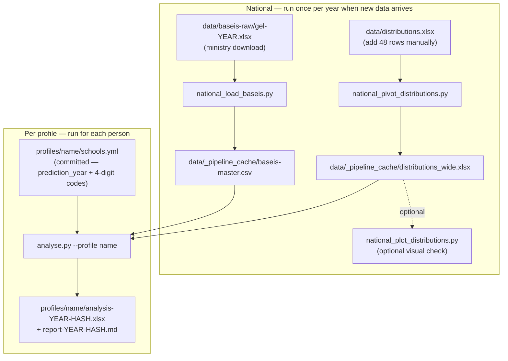

# Quickstart

Assumes `uv sync` has been run. All commands are executed from the repo root.

---

## How the pipeline works

Scripts split cleanly into two phases:



---

## Phase 1 — Update national data (once per year)

Run this section whenever results for a new academic year are published.

### Step 1 · New admission thresholds (βάσεις)

Download the ministry Excel file and place it in `data/baseis-raw/`:

| Year | URL |
|------|-----|
| 2023 | https://aeitei.gr/index.php?year=2023&pedio=3&likio_type=gh&order=2 |
| 2024 | https://aeitei.gr/index.php?sist=&sys=&vasi=basi&year=2024&pedio=3&aeitei=&city=&likio_type=gh&cat=1&order=2 |
| 2025+ | Pattern: `https://aeitei.gr/...year=YEAR...` — check the ministry site for the current year's URL |

Name the file `gel-YEAR.xlsx` and drop it in `data/baseis-raw/`. Then:

```bash
uv run python national_load_baseis.py
```

Verify: `data/_pipeline_cache/baseis-master.csv` contains rows for the new year.

### Step 2 · New grade distributions

Open `data/distributions.xlsx`, sheet `data-StudentsDistribution`, and add 48 new rows
(12 score bins × 4 subjects) for the new year. Source data:

| Year | URL |
|------|-----|
| 2023 | https://foititikanea.gr/statistika/2022/pinakes/8.php |
| 2024 | https://www.aeitei.gr/statistika-gel.php?year=2024 |
| 2025 | https://www.aeitei.gr/statistika-gel.php?year=2025 |
| 2026+ | Pattern: `https://www.aeitei.gr/statistika-gel.php?year=YEAR` |

Then:

```bash
uv run python national_pivot_distributions.py
uv run python national_plot_distributions.py   # optional — inspect the CDF plot
```

Verify: `data/_pipeline_cache/distributions_wide.xlsx` index includes the new year.

---

## Phase 2 — Profile analysis

Once Phase 1 is complete (or if the national data is already up to date), run the
per-profile analysis for each person:

```bash
uv run python analyse.py --profile maria
uv run python analyse.py --profile manou2026
```

Output (named after the `prediction_year` and the metric weight-set hash, both printed
at the end of the run):

- `profiles/{name}/analysis-{year}-{hash}.xlsx` — seven sheets: the weighted high-end
  metric, the metric weights, per-bin distribution diffs, baseis thresholds and shifts,
  long-format detail, and per-school predictions.
- `profiles/{name}/report-{year}-{hash}.md` — a markdown summary of the same.

The metric weights come from `metric_weights.yml` (repo root), optionally overridden
per-profile via a `metric_weights:` block in `schools.yml`. Every weight set used is
saved to the gitignored `weights/{hash}.{npy,yml}` store, so runs with different weights
never overwrite each other.

---

## Setting up a new profile

### What to do

1. Create `profiles/{name}/schools.yml` with the prediction year and the 4-digit
   ministry school codes:

   ```yaml
   prediction_year: 2025
   schools:
     - "0277"
     - "0279"
   ```

2. Run the analysis:

   ```bash
   uv run python analyse.py --profile {name}
   ```

That is all. The national data is shared — no need to touch any other file.

### Finding school codes

Query the master CSV to browse available schools:

```python
import pandas as pd

master = pd.read_csv('data/_pipeline_cache/baseis-master.csv', encoding='utf-8-sig')

# List all biology-accessible departments (field_3 = natural sciences)
bio = (master[master['field_3']][['school_code', 'institution', 'department']]
       .drop_duplicates()
       .sort_values('school_code'))
print(bio.to_string(index=False))
```

Or filter to a specific institution:

```python
master[master['institution'].str.contains('ΑΠΘ', na=False)][
    ['school_code', 'institution', 'department']
].drop_duplicates()
```

### What you do NOT need to do

| Task | Why not |
|------|---------|
| Add a `baseis.xlsx` per profile | Removed — baseis data comes from `baseis-master.csv` automatically |
| Re-run national scripts | They're shared; run once regardless of how many profiles exist |
| Add institution/department names to `schools.yml` | Derived on the fly from `baseis-master.csv` |
| Manually maintain year-over-year data | All years in the master are included automatically |

---

## Full command reference

```bash
# Update national data (once per year, in order)
uv run python national_load_baseis.py          # → data/_pipeline_cache/baseis-master.csv
uv run python national_pivot_distributions.py  # → data/_pipeline_cache/distributions_wide.xlsx
uv run python national_plot_distributions.py   # → output/distributions_plot.png (optional)

# Profile analysis (once per profile per year)
uv run python analyse.py --profile {name}      # → profiles/{name}/analysis-{year}-{hash}.xlsx + report
```
